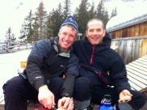
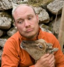

### [Dr. Andrew Beckerman](https://www.sheffield.ac.uk/aps/staff-and-students/acadstaff/beckerman) (left)
Senior Lecturer in the Department of Animal and Plant Sciences, University of Sheffield
Andrew’s research centres on phenotypic plasticity, food webs, and the many processes that link behaviour, population dynamics, and community structure. His phenotypic plasticity research extends from the genetic and endocrine basis of plasticity through to the community consequences of it (mostly of Daphnia). His work on food webs aims to reveal how foraging behaviour constrains the complexity and structure of large food webs. He also dabbles in parrot conservation. Andrew has used R for about 12 years, with particular expertise in general and generalised linear models, survival analysis, mixed effects models and programming.

### [Dr. Owen Petchey](http://www.ieu.uzh.ch/en/staff/member/petchey_owen.html) (right)
Associate Professor, Institute of Evolutionary Biology and Environmental Studies, University of Zurich
Owen’s research focuses on the causes and consequences of extinctions in a changing world. His group performs experiments with microbial communities, models the structure of food webs, analyses variation in biodiversity, and does fieldwork in Iceland, the UK, Switzerland, and the Seychelles. Owen has also used R for about 12 years, and has particular expertise in multivariate statistics, spatial data, programming, maximum likelihood estimation, and advanced visualisation (i.e., nice graphs!).

### [Dr. Dylan Childs](https://www.sheffield.ac.uk/aps/staff-and-students/acadstaff/childs) (top)
NERC Research Fellow and Lecturer in the Department of Animal and Plant Sciences, University of Sheffield
Dylan is a population biologist with pure and applied research interests. He uses models to understand population dynamics and natural selection in laboratory and free-living populations, with a particular emphasis on how demographic and ecological processes interact to shape selection in changing environments. Dylan has been using R for over 10 years, and has extensive experience using C and WinBugs.

### Dr Natalie Cooper
TBD.

Owen, Dylan, Andrew & Natalie have experience with Windows and OS X and are at least familiar with Mathematica, C variants, Matlab, Octave, Excel, Minitab, Systat, Sigmaplot, SAS, and GLIM.  However, they use only R (and some C variants).

