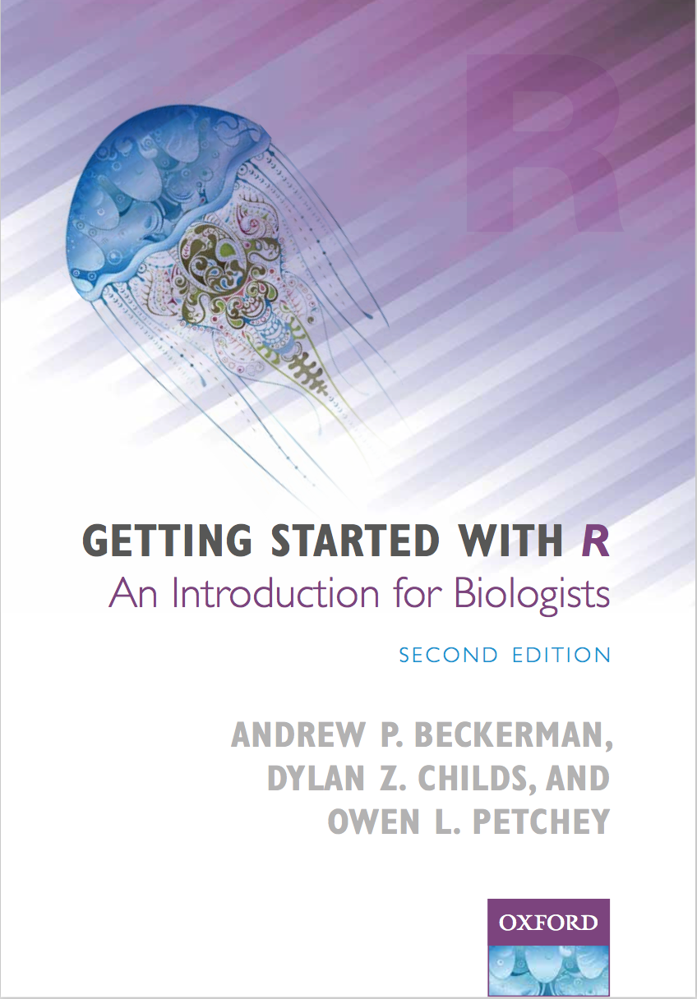

### Welcome to R4All

We specialise in teaching R to those who’ve never used it before. Just as good is if you’ve used it, or are using it, but want to improve your foundation and workflow.

A tried and tested course, The Booster Course, helps you up the initially steep learning curve, while providing an efficient, reliable, and simple method for using R.

Our book, [Getting Started with R, An Introduction for Biologists, Second Edition](../the-book), is great for those who can't (or don't want to) take a course with us.

